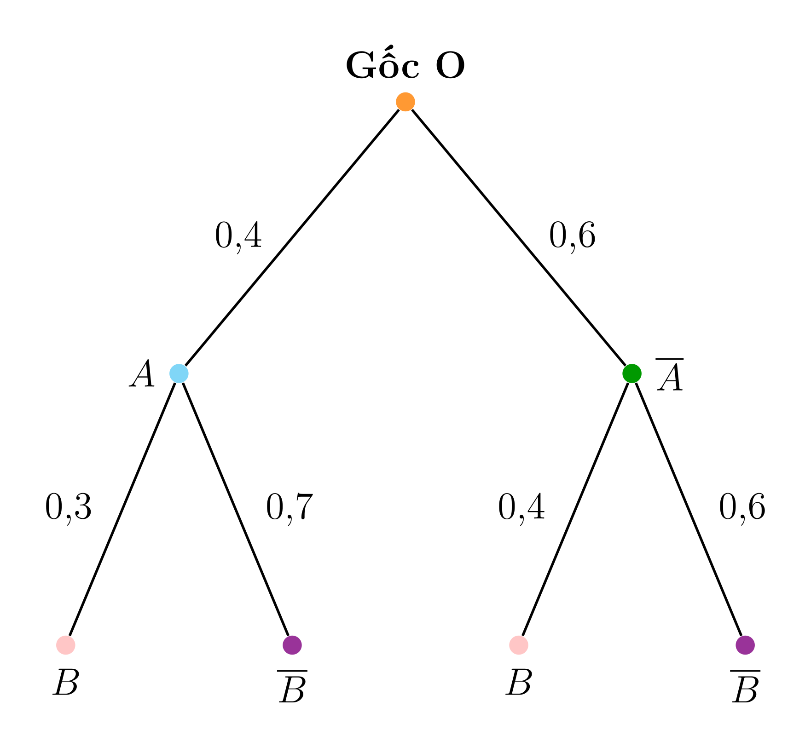

# Tree Diagram Builder

Web app vẽ sơ đồ cây xác suất (probability tree diagram), xuất TikZ/SVG/PNG.



## Features

- Visual tree diagram editor (click to add/edit nodes)
- LaTeX math support via KaTeX
- Export to TikZ code (compilable in LaTeX)
- Export to SVG/PNG images
- JSON save/load

## Tech Stack

- Next.js 14+ (App Router)
- TypeScript
- Tailwind CSS
- Zustand (state management)
- KaTeX (math rendering)
- Pure SVG + custom tree layout

## Target Users

Teachers and students who need to create probability tree diagrams for education.

## Getting Started

```bash
# Install dependencies
pnpm install

# Run development server
pnpm dev

# Build for production
pnpm build
```

## Deployment

Deploy to Vercel:

[](https://vercel.com/new/clone?repository-url=https://github.com/hieplequoc/so-do-cay)

## License

MIT
